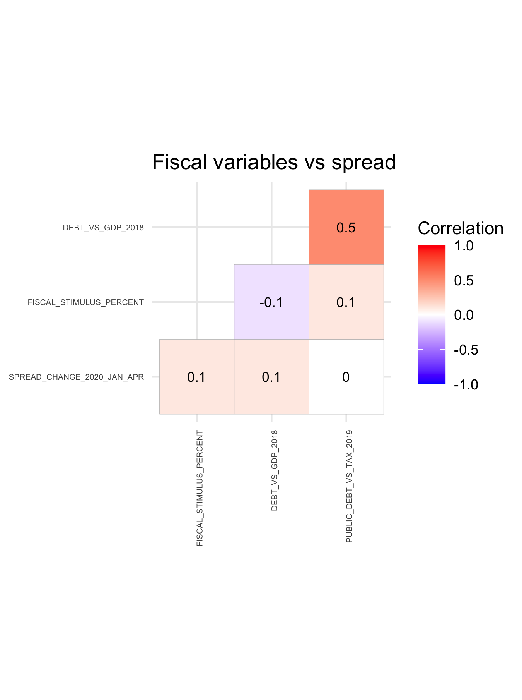

```{r setup, include=FALSE}
knitr::opts_chunk$set(echo = TRUE)
```


# Introduction
In many respects, the great financial crisis that began in 2007 was one of global liquidity. Particularly after the burst of Lehman Brothers on 15. September 2008, unprecedented stresses in global markets drove a worldwide flight into US dollars. This left global commercial banks high and dry. Otherwise unable to access the dollar liquidity they desperately needed to roll over their funding, governments and central banks engaged in a concerted effort to eschew a meltdown of the global financial system through unprecedented measures of liquidity provision: extremely low interest rates, swap lines, and quantitative easing. These liquidity measures had two soothing effects: On the one hand, stress in the global banking system was alleviated. On the other hand, low interest rates meant low funding costs. This enabled governments in both the developing and developed world to finance deficits and pile up sovereign debt, be it in their own currency or in US dollars. This relatively smooth period since the pinnacle of the great financial crisis ended abruptly with COVID-19. 

While initially thought contained in Wuhan, the WHO declared COVID-19 a global pandemic on March 11, 2020 as many countries had started reporting exponentially growing case numbers. As a consequence, governments throughout the world rightly focused on halting the spread of the coronavirus through lockdowns. However, the foreseeable explosion in sovereign debt as countries scramble to counter the pandemic’s grave economic consequences as well as the economic fallout generated by border closures and the interruption of entire global supply chains caused another worldwide flight into US dollars similar to the great financial crisis starting in 2007. While in the short run this affects emerging market sovereigns mostly indirectly through an increase in spreads, the longer-term consequences could be massive and detrimental. 

In this research paper, we examine the economic consequences of the COVID-19 pandemic for 33 investible emerging markets. Specifically, we perform an exploratory case study that tries to establish the underlying factors that drive the risk perception of international investors toward emerging market sovereigns. In doing so, we try to uncover patterns that could shine a light on the path ahead for emerging market sovereigns and to identify countries that will be more or less affected by the pandemic episode. 

The rest of the paper is structured as follows: Section 2 motivates the focus on emerging market sovereigns by pointing out differences between the current economic crisis and the great financial crisis and by outlining the specific weaknesses of emerging markets in the light of COVID-19. Based on this discussion, section 2 concludes by formulating hypotheses on the drivers behind the financial fragility of emerging market sovereigns. Section 3 discusses the data and presents the results of the exploratory analysis. Section 4 concludes 

# Emerging market sovereign debt and COVID-19

## Motivation for focus
The motivation behind focusing on emerging market sovereigns stems from the idea that the COVID-19 pandemic could lead to a global shortage of US dollars similar to the situation in 2007, which could morph into an emerging market debt crisis. In 2007, financialization had proceeded so far that there was no pool of reserves anywhere worldwide that was large enough to backstop the system and only a lender of last resort would do. Since the IMF never had the lending firepower necessary, only the US Federal Reserve had that kind of money. Thus, it almost single-handedly saved the global financial system through the reactivation of decades-old swap lines and a number of individual liquidity facilities. However, unlike 2007 the crisis of 2020 may be even bigger for two reasons. On the one hand, the economic slowdown happens in perfect global synchronization due the very nature of the virus being a global pandemic. Thus, all governments try to stimulate at the same time, therefore competing for the same funding sources. On the other hand, emerging markets now make up about one-third of global GDP while the US’ share is in a gradual decline, and so is the US’ relative capacity for providing dollar-based assets and liquidity. 

## Specific problems of emerging markets
Against the backdrop of the potential dollar shortage described above, emerging economies are bound to face particular obstacles which developed countries only face to a lesser extent. To varying degrees, emerging economies must navigate the COVID-19 pandemic amid:
* worsening terms of trade
* dwindling remittances
* domestic economic and health vulnerabilities
* tightening international credit conditions
In what follows, we first discuss each of these obstacles. Later, we derive hypotheses from the discussion. 

### Obstacle 1: worsening terms of trade
On the international trade side of things, many of the emerging economies are heavily reliant on the economic well-being of developed markets. In particular, emerging economies are focused on three types of exports: oil, tourism, and intermediate goods. 

Oil is a central pillar for many emerging economies, either as exports or as imports (see graph). For oil exporting emerging economies, oil revenues affect government finances either directly or indirectly. Some emerging market governments directly own oil producing companies or the rights to oil exports and thus hurt from lower oil revenues. Other governments indirectly hurt from lower oil exports as their revenue base shrinks when oil producing companies report falling revenues and earnings. For example in Nigeria, the largest economy in Africa, oil accounts for about 90 percent of exports and two-thirds of government revenue, two-thirds of which is destined to service debt. Oil importing countries primarily benefit from lower oil prices. 

Export revenues through tourism is another central pillar for many emerging economies. 
(See graph). However, due to extensive quarantines and border-closures, international arrivals dropped precipitously. 

The flight to US dollars induced a rapid depreciation of many emerging market currencies. This in turn leads to an increase in costs of imports, which hurts the spending power of households which are already struggling with income losses due to economic lockdowns and reduced exports. Of course, the depreciation also leads to strains when it comes to paying back debt in foreign currency. More about this later. 

### Obstacle 2: dwingdling remittances
In recent years, remittances were on track to become the largest source of external finance in developing countries, overtaking FDI flows. For example, excluding China, remittances to LMICs (\$462 billion) were significantly larger than FDI flows in 2018 (\$344 billion) according to the World Bank. These annual remittances of around \$500 billion from nationals working overseas contribute significantly to emerging market GDP, savings and financing balance of payments. The Philippines, for example, receives around \$34 billion a year in this manner, reducing the country’s current account deficit from 10% to around 1.5% of GDP. These remittances, which come primarily from foreign workers in hospitality, domestic work and construction, are bound to decrease as these are job fields that are particularly affected by the lockdown measures implemented in developing countries. Lower remittances ultimately affect the tax base of governments and hence worsens the outlook for sovereign finances.
 
### Obstacle 3: domestic economic and health vulnerability
Alongside the pain felt through reduced exports, worsening terms of trade, and decreasing remittances, the domestic economy of emerging markets appears relatively vulnerable to lockdown measures. Compared to developed countries, emerging economies on average have a larger share of the labor force employed in very small firms and workers have relatively low levels of education. These features of emerging economies increase the direct cost of social distancing because the share of jobs that can be done at home is much smaller. As such, there is a dire trade-off: open up and risk long-lasting negative supply shocks and human misery through countless mortalities but having a shallower recession and therefore higher tax revenues, or remaining relatively shut-down but risking a deeper recession, economic misery and therefore lower tax revenues, and ultimately political unrest. On top of this trade-off, even a gradual reopening is harder to do without new waves of infections. This is because policy measures in emerging economies are less effective in defeating the virus as hygiene conditions are often precarious in emerging markets due crowded workplaces and difficult living conditions. 

### Obstacle 4: tightening international credit conditions
The quick flight to US dollars and the continuing economic uncertainty render the credit conditions tighter for many emerging economies, both on the public and the private side. As many emerging market private corporations as well as sovereigns have borrowed in dollars and their currencies depreciated quickly, paying back debt will be hard. Anticipating this, international investors will be hesitant to lend to emerging market sovereigns, particularly when governments struggle to credibly commit future tax revenues to pay back debt, which limits their capacity to refinance outstanding debt. 
Some emerging market sovereigns have swap lines with the FED that alleaviate this problem to some extent. However, there are good reasons to expect the Fed to continue to be selective in entering swap lines: its goal is not to assist countries in distress, but rather to ensure that there is sufficient dollar liquidity to contain an excess increase in dollar strength abroad that could deepen the contraction at home. This explains the selection of “systemically important” emerging economies with deep currency markets as the choice recipients of the swaps.

In summary, emerging market sovereigns are going through a perfect storm and how they weather the storm is likely determined by a variety of factors. The beginning of the crisis has already highlighted existing divisions between stronger and weaker emerging economies, by putting governance and economic resilience to the test. South Korea, for example, has led the world in coronavirus testing and is being hailed as a model for many Western countries; by keeping track of COVID-19 clusters, it has been able to contain the outbreak without shutting down its whole economy. Brazil’s leadership, by contrast, has invited criticism by questioning the seriousness of the pandemic despite infections among senior members of the government. As such, the economic effects will likely diverge widely. Economies in north Asia, along with India and Chila, should benefit from lower energy prices; commodity exporters in Latin America and oil exports in the Middle East and Central Asia look more exposed. 

## Hypotheses

*	__Hypothesis 1:__ Dependence on oil explains financial fragility of emerging market sovereigns. 
* __Hypothesis 1a:__	Oil exporters more likely to experience spread increases
* __Hypothesis 1b:__	Oil importers less likely to experience spread increases
* __Hypothesis 2:__	Dependence on remittances likely to influence financial fragility of emerging market sovereigns.
* __Hypothesis 3:__	Adaptability of domestic economy likely to affect political and economic stability and thus financial fragility of emerging market sovereigns.
* __Hypothesis 4:__	Swap lines positive for sovereings. 

# Data and results


Country | JPM EMBI constituent (1 = yes)
------------- | -------------
Content Cell  | Content Cell
Argentina  | 1
Azerbaijan  | 1
Bahrain  | 1
Brazil  | 1
Chile  | 1
China  | 1
Colombia  | 1
Dominican Republic  | 1
Egypt  | 1
Ghana  | 1
Hungary  | 1
India  | 0
Indonesia  | 1
Kazakhstan  | 1
Malaysia  | 1
Mexico  | 1
Nigeria  | 1
Oman  | 1
Panama  | 1
Peru  | 1
Philippines  | 1
Poland  | 1
Qatar  | 1
Romania  | 1
Russian Federation  | 1
Saudi Arabia  | 1
South Africa  | 1
Sri Lanka  | 1
Thailand  | 0
Turkey  | 1
Ukraine  | 1
United Arab Emirates  | 1
Uruguay  | 1
In addition, we wanted to make sure that all the countris in the sample are not only investable by being in the EMBI but that they also have a certain amount of debt outstanding. To that end, we inspected the Debt/GDP ratio of all EMBI+2 countries in the IMF's global debt database and checked if all countries have at least a ratio of 20%. This was indeed the case so that we didn't drop any of the countries out of the sample. 


# Conclusion


This paper takes stock of the data gathered during the first four to six months of the year 2020. We say "four to six" because at the time of writing this document (early June), the data for June is not available yet. However, as soon as that data is available we will rerun the analysis and see if the results remain stable. In a nutshell: we explain the change in spread between 12/31/2019 - 04/30/2020 (and 12/31/2019 -  06/30/2020 as soon as the June data is out) through structural, macroeconomic, and epidemiologic variables. 

## Defining the sample of countries
In a first step, we had to choose which emerging markets we want to investigate. Since we are interested in the effect of COVID-19 on governments' ability to finance deficits in a sustainable way--that is, without increasing spreads beyond reasonable levels--we are primarily intersted in emerging markets which are "investible". As a starting point, we defined a country's "investibility" as being a constituent of the JPMorgan EMBI (Emerging Market Bond Index). This index gives investors exposure to U.S. dollar-denominated government bonds issued by emerging market countries. The index comprises more than 30 emerging market countries in a single fund. Specifically, when we looked up the constituent countries of the fund, it appears as if 31 countries are in the index as of 25 April 2020 (cf. [https://www.ishares.com/us/products/239572/ishares-jp-morgan-usd-emerging-markets-bond-etf](www.ishares.com/us/products/239572/ishares-jp-morgan-usd-emerging-markets-bond-etf) ). However, some relatively large and potentially important countries were not represented in the EMBI so that we added India and Thailand to the sample. This results in a sample of 33 countries. We call it the "EMBI+2" sample. This stands in contrast to the other project we are working on that looks at data of a 155 countries and which we call the "extended" sample. See the graph and table below for an overview of the countries in the sample.


The rest of this document is structured as follows: The second part outlines the data used for the analysis. The third part shows preliminary results of correlations between the variables. The fourth part shows regression results and graphical analyses. Part 5 concludes. 


# 2. Data
In the second step, we obtained data for the outcome variable(s) and the explanatory variables.

## Outcome variable(s)

* the spread of such bonds over 1-year US treasuries
* the yield of 1-year U.S. dollar-denominated bonds
* the exchange rate vis-à-vis the U.S. dollar
* CDS 
Specifically, our outcome variables are the changes of these four variables between the end of December 2019 and the end of April 2020 (June 2020). While our main outcome variable of interest is the change in spread over U.S. bonds over 4/6 months, we also look at the other variables as a robustness check. 

{ width=50% }

## Explanatory variable(s)
There are a host of explanatory variables in the dataset. Many of them are diretly sourced from the IMF World Datamapper or from the World Bank. However, due to the recency of the period of analysis and the lack of officially published data, we had to hand-code a decent chunk of the data. To do so, we looked at the IMF's country by country summary of policy responses to COVID-19 [https://www.imf.org/en/Topics/imf-and-covid19/Policy-Responses-to-COVID-19](https://www.imf.org/en/Topics/imf-and-covid19/Policy-Responses-to-COVID-19). While the following graph does not depict all explanatory variables that are in the dataset, it does show the most important ones which we also expect to be the ones that show a clearn pattern in explaning the economic fragility of emerging markets. 

{ width=50% }

## Data source
For the specific details on the variable definitions, the sources for each variable, as well as units and further information, see the sheet "codebook" in the document "data.xlsx". 


# 3. Preliminary patterns and correlations
Our dataset comprises more than 100 potential explanatory variables. However, most of them are not of direct interest and are instead only used to calculate variables that we use in our regressions. For example, while both the population size and the mortality is in the dataset, what is ultimately interesting is the standardized mortality rate per 100,000 people. As such, we do not show correlation matrices of all potential explantory variables but focus instead on variables that could be used in the regressions. For ease of overview, we devide the respective explanatory variables into four clusters:

* Variables related to the pandemic such as whether a quarantine is in place, infection rates, mortality rates etc.
* Variables related to fiscal fitness of sovereigns such as debt ratios, reserves etc. 
* Variables related to monetary aspects such as whether a sovereign has a swap line etc.
* Variables related to the effect of oil dependence of a sovereign such as the oil share of exports etc.

## Correlation matrices

{ width=50% }

{ width=50% }

{ width=50% }

{ width=50% }

## Correlation heat maps

{ width=50% }

{ width=50% }

{ width=50% }

{ width=50% }


# 4. Econometric results

{ width=50% }

{ width=50% }


{ width=50% }

{ width=50% }


# 5. Conclusion
As stated in the introduction, this paper is preliminary. As more data becomes available with the relase of June figures, the whole analysis will be rerun to see if the results align more with theoretical expectations or if there's potential variables that we have missed. It may also be that there is a null-result: it is not clear at this point in the pandemic which EM sovereigns will suffer the most. This may actually not be an improbable result given that financial market participants do not have a lot visibility and will probably stay on the side line for all EM instead of being choosy. 


